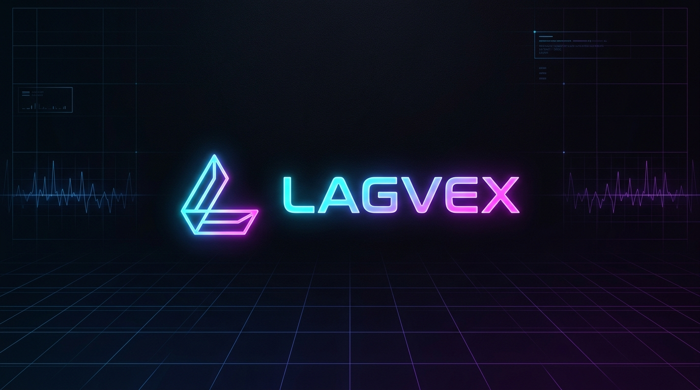

# ⚡ Lagvex 🚀

<p align="center">
  
</p>

<p align="center">
  <strong>🔥 Open-Source Gaming Latency Reducer & Split-Tunneling Ping Booster 🔥</strong><br>
  <em>⚡ Ultra-low ping • 🛡️ Zero memory injection • 🌐 Bypasses ISP throttling • 🛡️ Non-invasive kernel routing</em>
</p>

<p align="center">
  <a href="https://golang.org"></a>
  <a href="https://github.com/ThanhNguyxnOrg/lagvex"></a>
  <a href="docs/DISCLAIMER.md"></a>
  <a href="docs/DISCLAIMER.md"></a>
  <a href="LICENSE"></a>
</p>

---

> [!CAUTION]
> ### ⚠️ STRICT LEGAL DISCLAIMER & ZERO-LIABILITY NOTICE ⚠️
> **PLEASE READ THIS BEFORE DOWNLOADING, BUILDING, OR USING LAGVEX:**
>
> 🧪 **Academic & Research Purpose**: Lagvex is developed strictly as a free, open-source educational study on Layer-3 virtual network adapters and routing-table split tunneling.  
> 🚫 **NO Game Tampering**: Lagvex contains **NO** cheats, hacks, or bypass mechanisms. It does not read game memory, hook functions, or inject code into any game process.  
> ⛔ **ZERO LIABILITY FOR BANS**: Online game publishers (Riot Games, Valve, Krafton, EA, Activision, Ubisoft, etc.) enforce proprietary Terms of Service and automated anti-cheat systems. **Under NO circumstances shall the authors, maintainers, or contributors of Lagvex be held responsible or liable for any account bans, temporary suspensions, HWID penalties, competitive rank resets, or loss of in-game items/purchases resulting from your use of this software.**  
> 👉 **YOU USE THIS SOFTWARE ENTIRELY AT YOUR OWN RISK.** For the complete legal agreement, see [docs/DISCLAIMER.md](docs/DISCLAIMER.md).

---

## 📖 Table of Contents 📑

- [🎯 Why Lagvex?](#-why-lagvex)
- [🎮 Supported Games](#-supported-games)
- [📚 Documentation & Deep Dives](#-documentation--deep-dives)
- [🏗️ How It Works (Architecture)](#️-how-it-works-architecture)
- [🚀 Quick Start](#-quick-start)
  - [☁️ 1. Deploy Relay on VPS (One-Liner)](#️-1-deploy-relay-on-vps-one-liner)
  - [💻 2. Run Client (Windows, macOS, Linux)](#-2-run-client-windows-macos-linux)
- [🛠️ Building from Source](#️-building-from-source)
- [⚖️ Full Disclaimer & Ban Liability Waiver](#️-full-disclaimer--ban-liability-waiver)
- [📜 License](#-license)

---

## 🎯 Why Lagvex? 💡

When playing competitive online games (like **Valorant, CS2, PUBG, or Apex Legends**), standard domestic ISP routing frequently travels over congested submarine fiber corridors, resulting in:
- 📈 **High latency & ping spikes** (jumping from 30ms to 150ms+).
- 📉 **Jitter & rubberbanding** during critical clutch rounds.
- ❌ **Packet loss & choke** during peak evening hours (8:00 PM – 11:00 PM).

### 🥊 Traditional Solutions vs. Lagvex

| Feature | 🌐 Commercial VPNs | 💉 Injected Boosters (WinDivert) | ⚡ **Lagvex (Split-Tunneling)** |
|---|---|---|---|
| **Routing Scope** | 🐌 100% of whole PC traffic | 🎮 Process hooked | 🎯 **Only Game Server CIDRs** |
| **Discord / Browser Speed** | ⚠️ Ruined / Laggy | ✅ Direct | 🚀 **Full Gigabit Direct Speed** |
| **Anti-Cheat Interaction** | 🟡 Full-tunnel proxy | 🔴 **HIGH RISK (DLL / Socket Hook ban)** | 🟢 **Non-Invasive (Layer-3 Routes Only, [See Terms](docs/DISCLAIMER.md))** |
| **Memory Injection** | ❌ None | ⚠️ Intercepts sockets / memory | 🛡️ **Zero DLLs / Zero Memory hooks** |
| **Monthly Subscription** | 💸 $8 – $13 / month | 💸 $7 – $10 / month | 🎁 **100% FREE & Open-Source (MIT)** |
| **Self-Hostable** | ❌ Proprietary | ❌ Proprietary | ☁️ **1-Command Deploy on any VPS** |

---

## 🎮 Supported Games 🏆

Lagvex includes pre-verified, narrow CIDR IP pools for major competitive titles:

| Game Title | 🏷️ Genre | 🌐 Server Regions | 🛡️ Anti-Cheat Compatibility |
|---|---|---|---|
| **Valorant** 🎯 | Tactical FPS | Singapore (SEA), Tokyo (JP), Hong Kong (HK), Mumbai (IN), Frankfurt | ✅ Riot Vanguard |
| **Counter-Strike 2 (CS2)** 💣 | Tactical FPS | Singapore, Hong Kong, Tokyo, Seoul, Frankfurt (Valve SDR) | ✅ Valve Anti-Cheat (VAC) |
| **PUBG: BATTLEGROUNDS** 🪂 | Battle Royale | Singapore, Tokyo, Seoul, Frankfurt (Azure & AWS) | ✅ BattlEye + Zakynthos |
| **Apex Legends** ⚡ | Battle Royale | Singapore, Tokyo, Taiwan, Oregon (EA Multiplay) | ✅ Easy Anti-Cheat |
| **The Finals** 🏆 | Arena FPS | Singapore, Tokyo, Frankfurt | ✅ Easy Anti-Cheat |
| **Call of Duty: Warzone / MW3** 🎖️ | FPS / BR | Singapore, Tokyo, US-West (Demonware) | ✅ RICOCHET Anti-Cheat |
| **Delta Force: Hawk Ops** 🦅 | Tactical Shooter | Singapore, Hong Kong (Tencent Cloud / AWS) | ✅ ACE Anti-Cheat |
| **Overwatch 2** 🛡️ | Hero Shooter | Singapore, Taiwan, Korea, Japan | ✅ Blizzard Defense Matrix |
| **Rainbow Six Siege** 🧱 | Tactical Shooter | Singapore (SEAU), Japan East (Ubisoft Azure) | ✅ BattlEye |
| **League of Legends (LoL)** ⚔️ | MOBA | Vietnam (VNG), Singapore (Riot Direct), Taiwan | ✅ Riot Vanguard |
| **Dota 2** 🛡️ | MOBA | Singapore (SEA), Japan (Valve SDR) | ✅ Valve VAC |

*💡 Need a different game? Click **+ Add Custom Game** in the Web Dashboard to register any game executable and custom server IP range in seconds!*

---

## 📚 Documentation & Deep Dives 📑

| 📖 Document | 📝 Description |
|---|---|
| 📐 [**Architecture Overview**](docs/ARCHITECTURE.md) | In-depth packet journey, WinTun driver mechanics, Windows routing safety rules, and anti-cheat safety analysis. |
| 📡 [**Wire Protocol v1 Specification**](docs/PROTOCOL.md) | Binary packet format, HMAC-SHA256 handshake, 9-byte data header, keepalive ping/pong, and MTU arithmetic. |
| 🚀 [**VPS Deployment Guide**](docs/DEPLOYMENT.md) | Step-by-step VPS operator instructions, automated one-liner script, systemd configuration, and Docker Compose. |
| 🌐 [**Game Profiles & CIDRs**](docs/PROFILES.md) | Profile JSON schema, cloud provider network maps (Valve SDR, Riot Direct, AWS, Azure), and capturing new games. |
| 🔬 [**Networking Research & Whitepaper**](docs/RESEARCH.md) | Empirical network latency studies, bufferbloat mitigation, and kernel-level packet scheduling research. |
| 🌐 [**Why a Relay (VPS) is Required**](docs/WHY_VPS.md) | **Technical FAQ**: Why an intermediate relay server is physically needed, ISP undersea routing limits, squad sharing, and vendor-neutral specs. |
| ⚖️ [**Legal Disclaimer & Ban Waiver**](docs/DISCLAIMER.md) | **Crucial reading**: Educational use terms, anti-cheat policy, and zero ban liability agreement. |

---

## 🏗️ How It Works (Architecture) ⚙️

```text
  [ 🎮 Game Client: Valorant / CS2 / PUBG ]
         │
         │ Sends UDP/TCP packets to game server (e.g. 13.250.0.0/15)
         ▼
  [ 🪟 Windows / macOS / Linux Routing Table ]
         │
         ├─► [ 🎯 Game Destination CIDR ] ──► [ 🔌 WinTun / utun Adapter ] (10.88.0.2)
         │                                               │
         │                                               ▼
         │                                    [ ⚡ Lagvex Client Engine ]
         │                                               │ Encloses with 9-byte header
         │                                               ▼
         │                                    [ 📦 UDP Socket to Relay ]
         │                                               │ (Pinned /32 route forces physical NIC)
         │                                               ▼
         └─► [ 🌐 Discord / Browsers / Streaming ] ──► [ 🏡 Default Physical Gateway ] (Direct ISP)
                                                         │
  ═══════════════════════════════════════════════════════╪═══════════════════════════════════════════════
                      International Fiber Backbone      │
  ═══════════════════════════════════════════════════════╪═══════════════════════════════════════════════
                                                         │
                                                         ▼
                                          [ ☁️ Lagvex Relay Server (Linux VPS) ]
                                                         │ Strips 9-byte header, anti-spoofing check
                                                         │ Writes raw IPv4 into /dev/net/tun: lagvex0
                                                         ▼
                                          [ 🐧 Linux Kernel (VPS) ]
                                                         │ iptables NAT MASQUERADE + TCP MSS Clamping
                                                         ▼
                                          [ 🎯 Game Server (Singapore / Tokyo / Frankfurt) ]
```

---

## 🚀 Quick Start 🏁

### ☁️ 1. Deploy Relay on VPS (One-Liner)

Deploy on any Linux VPS (**Ubuntu, Debian, CentOS, Rocky Linux, AlmaLinux, Arch**) located close to your target game servers (e.g. Singapore or Tokyo):

```bash
curl -fsSL https://raw.githubusercontent.com/ThanhNguyxnOrg/lagvex/main/scripts/install-relay.sh | sudo bash
```

**What the installer does automatically:**
1. 🔧 Configures kernel `sysctl` for maximum throughput (`ip_forward=1`, `rp_filter=2`, 8MB UDP buffers).
2. 🛡️ Sets up `iptables` NAT MASQUERADE and TCP MSS clamping that persist across server reboots.
3. 🔑 Generates a cryptographically random 32-character Pre-Shared Key (PSK).
4. ⚙️ Registers and launches the `lagvex-relay.service` systemd daemon.
5. 📋 Outputs your connection endpoint and PSK snippet ready to paste into your client!

*(Prefer Docker? Just run `docker compose up -d`)*

---

### 💻 2. Run Client (Windows, Linux, macOS) 🎮

Lagvex provides first-class, native support across all three major gaming desktop operating systems:

| Platform | ⚙️ Driver Mechanism | 🎯 Ideal Use Case | 🚀 Command to Run |
|---|---|---|---|
| **Windows 10/11** 🪟 | Official `wintun.dll` Layer-3 ring buffer | Valorant, CS2, PUBG, Apex, The Finals, Warzone, Delta Force | `lagvex-client.exe` *(opens Standalone Desktop Window HUD)* |
| **Linux & Steam Deck** 🐧 | Linux Kernel `/dev/net/tun` + `ip route` | Steam Deck (SteamOS), Proton gaming, CS2 native, Dota 2, Apex | `sudo ./lagvex-client-linux-amd64` |
| **macOS (Apple Silicon)** 🍎 | Darwin native `utun` + BSD `route` | League of Legends (Mac native), Dota 2, Apple GPTK2 games | `sudo ./lagvex-client-darwin-arm64` |

#### 🌟 Quick Launch Options:
```bash
# 🖥️ 1. Start Desktop HUD Window (auto-launches standalone app window at http://127.0.0.1:18888):
lagvex-client.exe

# ⚡ 2. Or connect immediately via headless Command Line (CLI):
lagvex-client.exe -connect -relay 123.45.67.89:4433 -psk your_secret_psk -game valorant -region asia-sg
```

---

## 🛠️ Building from Source 🔨

Requires **Go 1.22+**:

```bash
# 📥 1. Clone repository
git clone https://github.com/ThanhNguyxnOrg/lagvex.git
cd lagvex

# 🧪 2. Run unit tests
make test

# ☁️ 3. Build Linux VPS Relay binary
make relay

# 🪟 4. Build Windows Client executable
make client

# 🍎 5. Build macOS Apple Silicon Client
make client-mac

# 🐧 6. Build Linux / Steam Deck Client
make client-linux
```

---

## ⚖️ Full Disclaimer & Ban Liability Waiver ⚠️

> [!WARNING]
> ### 🛑 EXPRESS WAIVER OF LIABILITY CONCERNING ACCOUNT SUSPENSIONS / BANS 🛑
> 
> 1. **🔬 Research & Educational Demonstration**:  
>    Lagvex is distributed strictly for technical research into network routing protocols and user-space virtual network adapters. It is **not** designed, intended, or marketed to bypass game bans, avoid region locks, or violate intellectual property rights.
> 
> 2. **🚫 Absolute Absence of Cheats / Exploits**:  
>    Lagvex does **NOT** read, manipulate, or write to any game memory space. It does **NOT** inject DLLs, alter game files, or modify gameplay packets. All packet diversion occurs externally via the host operating system's kernel routing table.
> 
> 3. **📜 Terms of Service & Anti-Cheat Autonomy**:  
>    Game publishers (e.g. Riot Games, Valve, Krafton, EA, Activision, Ubisoft) and proprietary anti-cheat engines (Vanguard, VAC, BattlEye, EAC, RICOCHET) retain absolute discretion to flag or penalize accounts utilizing proxies, VPNs, or unauthorized software as outlined in their respective End User License Agreements (EULA).
> 
> 4. **🛡️ ZERO DEVELOPER RESPONSIBILITY FOR ACCOUNT ACTIONS**:  
>    **BY DOWNLOADING, COMPILING, OR RUNNING LAGVEX, YOU EXPRESSLY AGREE THAT THE AUTHORS, CONTRIBUTORS, AND REPOSITORY OWNERS SHALL NOT BE LIABLE FOR ANY DAMAGES, SANCTIONS, TEMPORARY SUSPENSIONS, PERMANENT ACCOUNT BANS, HARDWARE ID (HWID) BLACKLISTING, LOSS OF IN-GAME ASSETS, OR FINANCIAL LOSSES OF ANY KIND.**  
>
> 5. **🤝 User Discretion**:  
>    You accept full, sole, and exclusive responsibility for any consequences arising from running this software alongside third-party games. If you do not agree with these terms, do not download, compile, or use this software.
>
> 📄 Read the complete legal text: [docs/DISCLAIMER.md](docs/DISCLAIMER.md)

---

## 📜 License 📄

Lagvex is open-source software licensed under the **[MIT License](LICENSE)**. Feel free to fork, customize, and self-host! 🎉
